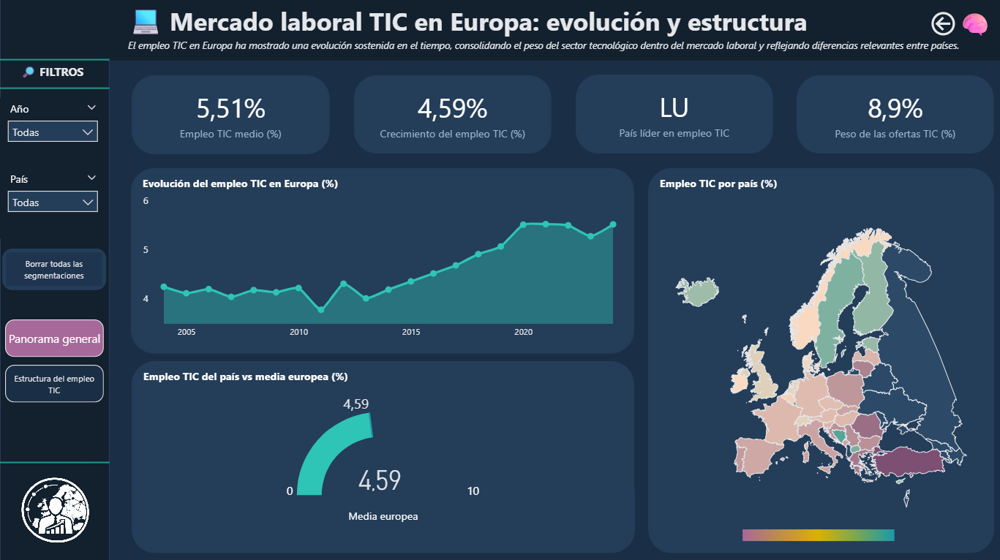
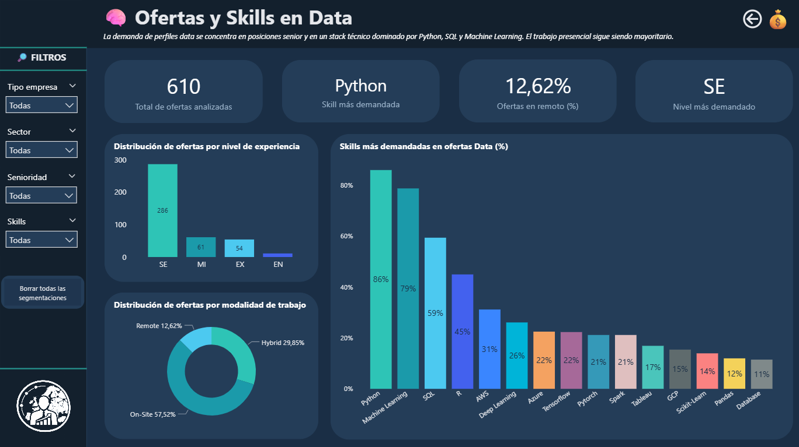
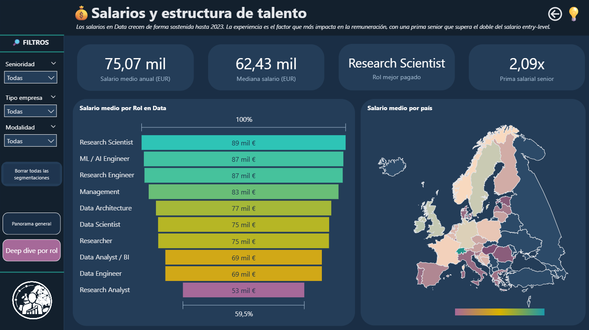

# 📊 Data Analytics Project · Power BI


## 💻 Mercado Laboral TIC en Europa: Evolución y Estructura
### Radiografía del empleo tecnológico en Europa: brecha de género, demanda de skills y evolución salarial

> Proyecto de visualización en Power BI del Bootcamp de Data Analytics — Adalab  
> Desarrollado por **Arantxa Barea** y **Camila López**

---

## 📑 Índice

1. [Executive Summary](#-executive-summary)
2. [Problema de negocio](#-problema-de-negocio)
3. [Datasets](#️-datasets)
4. [Enfoque analítico](#-enfoque-analítico)
5. [Hallazgos clave](#-hallazgos-clave)
6. [Dashboards](#-dashboards-power-bi)
7. [Stack tecnológico](#️-stack-tecnológico)
8. [Estructura del repositorio](#-estructura-del-repositorio)
9. [Cómo ejecutar el proyecto](#️-cómo-ejecutar-el-proyecto)
10. [Posibles mejoras futuras](#-posibles-mejoras-futuras)
11. [Estado del proyecto](#-estado-del-proyecto)
12. [Equipo](#-equipo)

---

## 🚀 Executive Summary

El sector TIC europeo muestra un crecimiento sostenido, pero los datos revelan una estructura marcada por desigualdades y concentraciones que van más allá del simple volumen de empleo:

| Métrica | Valor | Lectura |
|--------|-------|---------|
| Empleo TIC medio en Europa | 5,51% | Más de 1 de cada 20 empleados trabaja en TIC |
| Crecimiento del empleo TIC | 4,59% | Expansión sostenida del sector |
| País líder en empleo TIC | LU (Luxemburgo) | Alta concentración en economías digitalmente avanzadas |
| Peso de las ofertas TIC | 8,9% | El sector genera casi 1 de cada 10 vacantes online |
| Brecha de género | 66% M vs 22% F | Dos de cada tres empleados TIC son hombres |
| Top skill demandada | Python (86% ofertas) | Dominio de Python prácticamente obligatorio en perfiles data |

> **La conclusión central:** el mercado TIC europeo crece de forma sostenida, pero con una estructura muy desigual — en género, en geografía y en nivel de experiencia demandado. El perfil más solicitado es senior, técnico y mayoritariamente masculino.

---

## 🎯 Problema de negocio

El sector tecnológico crece, pero los datos plantean tres preguntas críticas que este proyecto responde:

- ¿Qué perfil demográfico y formativo tiene el empleo TIC en Europa?
- ¿Qué skills y roles concentran la demanda real del mercado?
- ¿Cómo evolucionan los salarios por país y por rol, y dónde están las mayores oportunidades?

---

## 🗃️ Datasets

El proyecto trabaja con fuentes de datos complementarias de distinta naturaleza:

### 1 · Eurostat — Empleo TIC en Europa (ISOC)

- Indicadores estadísticos oficiales sobre el mercado laboral TIC europeo
- Desagregaciones por **edad, sexo, nivel educativo, sector económico y tamaño de empresa**
- Cobertura: 33 países europeos, serie temporal 2000–2023
- Múltiples tablas

### 2 · Kaggle — Ofertas de empleo Data Science (2025)

- 944 ofertas scrapeadas de LinkedIn
- Variables: puesto, empresa, skills requeridas, salario, ubicación, modalidad y seniority
- Representativo del mercado de perfiles data a nivel global con foco en Europa

### 3 · Kaggle — Datasets consolidados de salarios tech (2020–2024)

- Histórico de salarios en el sector tech procedentes de Kaggle
- Variables: año, rol, país, nivel de experiencia, modalidad de trabajo, salario en USD

> ⚠️ **Nota metodológica:** los datasets de Eurostat recogen el total del empleo TIC; los datasets de Kaggle y el propio se centran en perfiles de ciencia de datos. Ambas dimensiones son complementarias pero no directamente comparables, y esta distinción se mantiene explícita a lo largo del análisis.

---

## 🧠 Enfoque analítico

El análisis se estructura en tres dimensiones:

### 🌍 Dimensión 1 — Panorama general del empleo TIC en Europa y Estructura del empleo TIC

Evolución temporal y distribución geográfica del empleo TIC:

- Tendencia de crecimiento del peso TIC en el empleo total europeo desde 2003
- Comparativa entre países: Luxemburgo como líder destacado frente a la media europea del 5,51%
- Análisis del peso de las ofertas online TIC sobre el total del mercado laboral
- Perfil demográfico y sectorial del profesional TIC en Europa:

| Variable | Distribución destacada |
|----------|----------------------|
| Sexo | 66% hombres / 22% mujeres |
| Edad | 51% en franja 35-74 / 41% en 15-34 |
| Educación | 51% educación superior / 38% media-baja |
| Sector | 41% ICT / 25% Servicios Profesionales / 8% Industria |

### 💼 Dimensión 2 — Ofertas y Skills y Salarios Data

Demanda concreta del mercado para perfiles data:

- **610 ofertas** analizadas con Python como skill requerida en el 86% de los casos
- Stack técnico dominante: Python → Machine Learning → SQL → R → AWS
- Seniority: el nivel SE (Senior Engineer) acapara 286 de las 401 ofertas clasificadas
- Modalidad: presencial mayoritaria (57,52%) con crecimiento del híbrido (29,85%)

### 💰 Dimensión 3 — Salarios Data

- Evolución salarial por año, país y rol — con análisis de dónde se concentran los mayores rangos

---

## 💡 Hallazgos clave

```
┌─────────────────────────────────────────────────────────────────────────────┐
│  El empleo TIC crece, pero está concentrado: geográficamente en el norte    │
│  y oeste de Europa, demográficamente en hombres con educación superior,     │
│  y técnicamente en perfiles senior con dominio de Python y ML.              │
└─────────────────────────────────────────────────────────────────────────────┘
```

- **Crecimiento sostenido:** el empleo TIC en Europa ha crecido de forma continua desde 2010, con aceleración visible a partir de 2015
- **Brecha de género persistente:** la participación femenina en el sector apenas alcanza el 22%, una de las más bajas entre sectores de alta cualificación
- **Python es el nuevo inglés del mercado data:** presente en el 86% de las ofertas, muy por delante de Machine Learning (79%) y SQL (59%)
- **El mercado pide séniors:** el 70% de las ofertas se dirigen a perfiles SE o EX, dejando poco espacio a perfiles junior
- **Luxemburgo y los países nórdicos** lideran tanto en porcentaje de empleo TIC como en niveles salariales
- **El salario crece con el tiempo y la especialización:** los roles de ML Engineer y Data Scientist muestran las horquillas más altas en el mercado europeo

---

## 📊 Dashboards Power BI

El proyecto incluye **3 dashboards interactivos** desarrollados en Power BI:

### DB1 · Mercado Laboral TIC en Europa


### DB2 · Ofertas y Skills en Data


### DB3 · Evolución Salarial


### Resumen

| Dashboard | Pregunta central | Elementos clave |
|-----------|-----------------|-----------------|
| DB1 · Mercado Laboral TIC en Europa | ¿Cómo evoluciona, se distribuye y qué perfil tiene el empleo TIC europeo? | Vista **Panorama general**: línea temporal · Mapa por país · Gauge vs media europea — Vista **Estructura del empleo TIC**: barras por sexo, edad, educación y sector · Mapa (ambas vistas conviven en el mismo dashboard con paneles que se muestran/ocultan) |
| DB2 · Ofertas y Skills en Data | ¿Qué skills y perfiles demanda el mercado data? | KPIs · Barras de skills requeridas · Distribución por seniority · Donut modalidad de trabajo |
| DB3 · Evolución Salarial | ¿Cómo evolucionan los salarios en el sector tech por año, país y rol? | Evolución temporal · Comparativa por país · Análisis por rol |

> 📌 **Nota:** los dashboards están disponibles en el archivo `.pbix` dentro de `reports/dashboards/`. Los filtros de Año, País, Empresa, Sector, Senioridad y Skills permiten exploración interactiva cruzada entre las tres vistas.

---

## 🛠️ Stack tecnológico

| Categoría | Herramienta | Uso |
|-----------|-------------|-----|
| Lenguaje | Python 3.11 | Pipeline de preparación de datos |
| Manipulación de datos | Pandas · NumPy | EDA, limpieza y transformación |
| Visualización exploratoria | Matplotlib · Seaborn | Análisis previo a Power BI |
| ETL y modelado | Power Query | Homogeneización de fuentes, relaciones y medidas DAX |
| Visualización ejecutiva | Power BI Desktop | 3 dashboards interactivos |
| Fuentes de datos | Eurostat · Kaggle · Dataset propio | Empleo TIC, ofertas y salarios |

---

## 📂 Estructura del repositorio

```
📦 proyecto-da-promo-64-modulo-4-powerbi-team-3
│
├── 📁 data/
│   ├── raw/                              # Datasets originales sin modificar
│   └── processed/                        # Datasets limpios y preparados para Power BI
│       ├── ds_salaries_2020_2024.csv
│       ├── eu_ds_jobs_salaries.csv
│       ├── ict_employment_by_age.csv
│       ├── ict_employment_by_education.csv
│       ├── ict_employment_by_gender.csv
│       ├── ict_employment_by_sector.csv
│       ├── ict_hiring_by_company_size.csv
│       ├── ict_hiring_by_sector.csv
│       ├── ict_job_ads_share.csv
│       ├── ict_share_total_employment_eu.csv
│       ├── job_posts_ds_2025.csv
│       └── tech_jobs_by_role.csv
│
├── 📁 notebooks/
│   ├── 00-concat.ipynb                   # Concatenación y unión de fuentes
│   ├── 01_eda.ipynb                      # Análisis exploratorio
│   └── 02_data_cleaning.ipynb            # Limpieza y validación
│
├── 📁 docs/
│   ├── eda_report.md                     # Informe del análisis exploratorio
│   └── data_cleaning_report.md           # Informe de limpieza y decisiones tomadas
│
├── 📁 reports/
│   ├── dashboards/                       # Archivo .pbix de Power BI
│   └── figures/                          # Capturas y figuras exportadas
│
├── requirements.txt
├── .gitignore
└── README.md
```

---

## ▶️ Cómo ejecutar el proyecto

**1 · Clonar el repositorio**
```bash
git clone https://github.com/camilalopezmrt/proyecto-da-promo-64-modulo-4-powerbi-team-3.git
```

**2 · Crear entorno virtual**
```bash
python -m venv venv
source venv/bin/activate        # Mac/Linux
venv\Scripts\activate           # Windows
```

**3 · Instalar dependencias**
```bash
pip install -r requirements.txt
```

**4 · Ejecutar los notebooks en orden**
```
00-concat.ipynb          →  Concatenación y unión inicial de fuentes
01_eda.ipynb             →  Análisis exploratorio estructurado
02_data_cleaning.ipynb   →  Limpieza, validación y exportación a /processed
```

**5 · Abrir el dashboard**

Abre el archivo `.pbix` en `reports/dashboards/` con Power BI Desktop.  
Los datos procesados en `data/processed/` ya están listos para ser cargados a través de Power Query.

---

## 🔮 Posibles mejoras futuras

- Publicación del informe en Power BI Service para acceso online
- Incorporación de datos más recientes de Eurostat (2024–2025) cuando estén disponibles
- Segmentación por comunidad autónoma para el mercado español
- Análisis de tendencias en la demanda de skills emergentes (LLMs, MLOps, GenAI)
- Modelo predictivo de evolución salarial por perfil y región

---

## ✅ Estado del proyecto

| Fase | Estado |
|------|--------|
| Recopilación y concatenación de fuentes | ✅ Completado |
| EDA y limpieza de datos | ✅ Completado |
| Modelado y transformaciones en Power Query | ✅ Completado |
| Diseño y desarrollo de dashboards | ✅ Completado |

---

## 👩‍💻 Equipo

El proyecto fue desarrollado de forma colaborativa en todas sus fases — recopilación de datos, análisis, limpieza y visualización.

<table>
  <tr>
    <td align="center">
      <b>Arantxa Barea</b><br><br>
      <a href="https://www.linkedin.com/in/arantxa-barea">
        
      </a>
      &nbsp;
      <a href="https://github.com/arantxa-90">
        
      </a>
    </td>
    <td align="center">
      <b>Camila López</b><br><br>
      <a href="https://www.linkedin.com/in/camila-adriana-lopez-martin">
        
      </a>
      &nbsp;
      <a href="https://github.com/camilalopezmrt">
        
      </a>
    </td>
  </tr>
</table>

---

## 🧩 Pipeline analítico

```
1️⃣ Recopilación de datos  
Eurostat · Kaggle · Dataset propio  

2️⃣ Preparación de datos  
EDA estructurado · limpieza y validación en Python  

3️⃣ Modelado  
Power Query + medidas DAX  

4️⃣ Visualización  
Dashboards interactivos en Power BI  

5️⃣ Comunicación  
Análisis de insights y storytelling
```

---

## 📄 Licencia

Proyecto académico desarrollado en el marco del Bootcamp de Data Analytics de Adalab.  
Uso educativo — los datasets de Eurostat son de acceso público; los de Kaggle están sujetos a sus respectivas licencias de uso.

---

## 💬 Conclusión

> *"El sector TIC europeo no solo crece: se consolida como uno de los motores del mercado laboral.*  
> *Pero su estructura revela brechas profundas — de género, de geografía y de experiencia —*  
> *que representan tanto el mayor reto del sector como su mayor oportunidad de desarrollo."*

---

<div align="center">
  <sub>Proyecto desarrollado en el Bootcamp de Data Analytics · Adalab · 2026</sub>
</div>